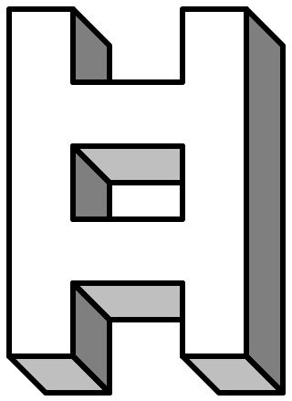

# Homework



<!-- [](#releases) -->
[](#license)
[](#download)

Homework is a WIP Sass CSS framework, focused on design-oriented generic-object and utility classes on a basis of responsive (`@media`-scoped) CSS custom properties.

- hybrid utility-first / object-oriented approach, focused on layout and typography "primitives"
- responsive (@media-scoped) values

## Installation
```sh
# install -- NB alpha version
npm i @lunelson/homework@next

# install peer dependencies
@lunelson/sass-calc @lunelson/sass-maps-next @lunelson/sass-throw @lunelson/sass-u mathsass
```
